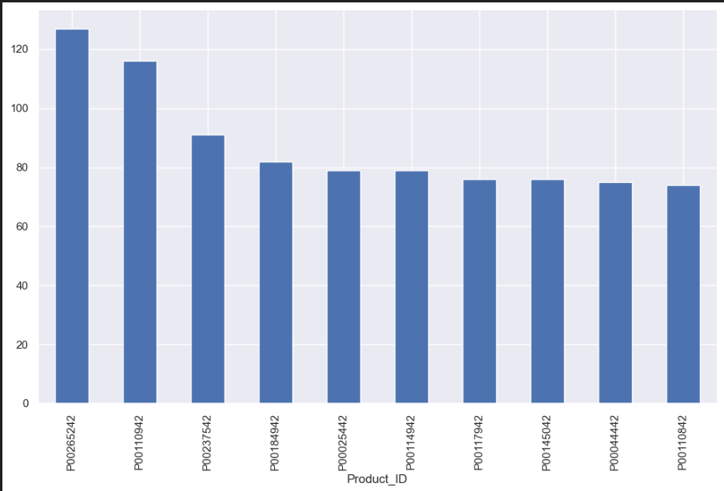
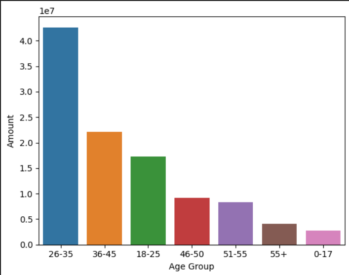
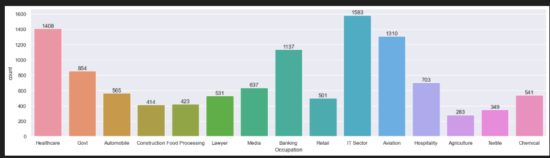

# HorizonTechX_EDA_Diwali-Sales-Analysis
Exploratory Data Analysis (EDA) of the Diwali Sales dataset using Python to uncover customer purchasing patterns and business insights.

# 🪔 Diwali Sales Analysis using Python

## 📌 Project Overview

This project presents an Exploratory Data Analysis (EDA) of the Diwali Sales dataset using Python. The objective is to clean, explore, and analyze the dataset to understand customer purchasing behavior, sales trends, and demographic patterns. The insights obtained from this analysis can support data-driven business and marketing decisions.

---

## 🎯 Objectives

* Perform data cleaning and preprocessing.
* Analyze customer demographics and purchasing behavior.
* Explore sales trends using visualizations.
* Identify high-performing customer segments.
* Generate meaningful business insights from the data.

---

## 📂 Dataset

* **Dataset:** Diwali Sales Dataset
* **File Format:** CSV

---

## 🛠️ Technologies Used

* Python
* Jupyter Notebook
* Pandas
* NumPy
* Matplotlib
* Seaborn

---

## 📊 Project Workflow

1. Data Loading
2. Data Exploration
3. Data Cleaning
4. Handling Missing Values
5. Exploratory Data Analysis (EDA)
6. Data Visualization
7. Business Insights

---

## 📈 Analysis Performed

* Gender-wise Sales Analysis
* Age Group Analysis
* Marital Status Analysis
* State-wise Sales Analysis
* Occupation Analysis
* Product Category Analysis
* Top-Selling Products

---

## 📸 Visualizations

### purchasing power Sales Analysis

### Age Group Analysis

### occupation Analysis

## 🔍 Key Insights

* Female customers contributed a significant share of total purchases.
* Customers aged **26–35 years** represented one of the most active purchasing groups.
* Sales were concentrated across a few high-performing states.
* Certain product categories generated higher customer demand.
* Customer demographic analysis can help businesses improve targeted marketing strategies.

---

## 👩‍💻 Author

**Alisha Khan**
